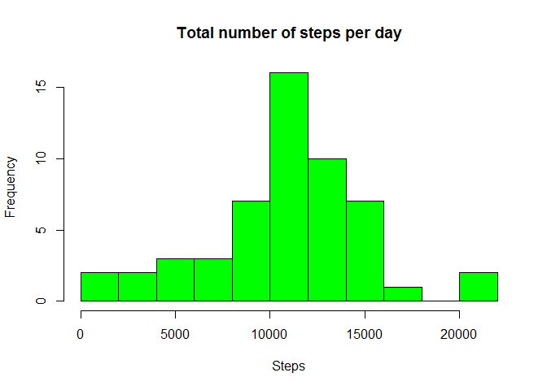
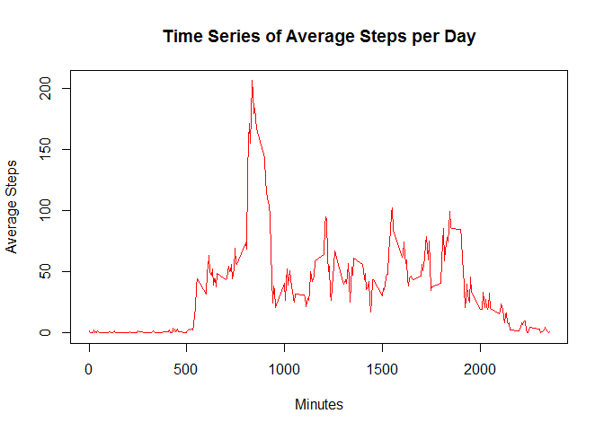
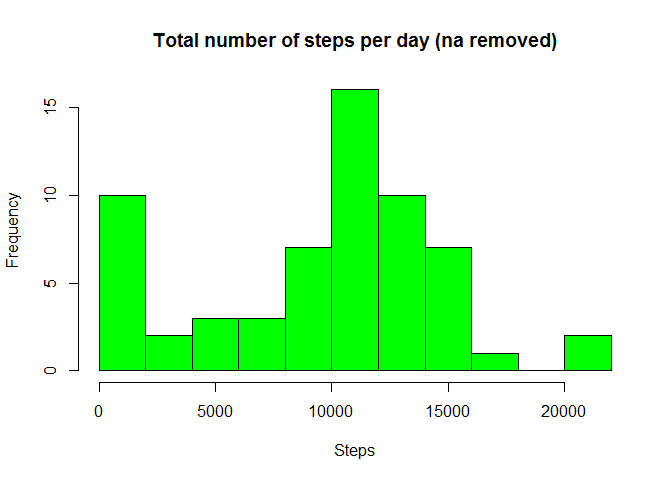
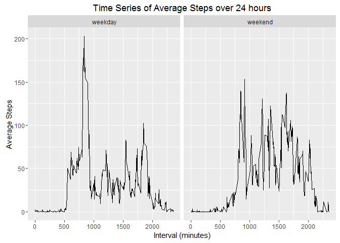

# Reproducible Research: Peer Assessment 1

## Loading and preprocessing the data 


```r
library(dplyr)
```

```
## Warning: package 'dplyr' was built under R version 3.1.3
```

```r
library(ggplot2)
```

```
## Warning: package 'ggplot2' was built under R version 3.1.3
```


```r
## - Read data into data frame

activity <- read.csv(file=unz("activity.zip", filename="activity.csv"))
head(activity)
```

```
##   steps       date interval
## 1    NA 2012-10-01        0
## 2    NA 2012-10-01        5
## 3    NA 2012-10-01       10
## 4    NA 2012-10-01       15
## 5    NA 2012-10-01       20
## 6    NA 2012-10-01       25
```

## What is mean total number of steps taken per day?


```r
##--- calculate steps per day
date_sum_group <- summarise(group_by(activity, date), sum_steps = sum(steps))
head(date_sum_group)
```

```
## Source: local data frame [6 x 2]
## 
##         date sum_steps
##       (fctr)     (int)
## 1 2012-10-01        NA
## 2 2012-10-02       126
## 3 2012-10-03     11352
## 4 2012-10-04     12116
## 5 2012-10-05     13294
## 6 2012-10-06     15420
```

```r
##--- calculate the mean and median of the number of steps per day
mean <- mean(date_sum_group$sum_steps, na.rm=TRUE)
median <- median(date_sum_group$sum_steps, na.rm=TRUE)

##--- plot the steps per day
hist(date_sum_group$sum_steps, breaks=15, col="green", main="Total number of steps per day", xlab="Steps") 
```

<!-- -->

- The **mean** number of steps taken per day is **10766**.
- The **median** number of steps taken per day is **10765**.

## What is the average daily activity pattern?


```r
## Make a time series plot (i.e. type = "l" of the 5-minute interval 
## (x-axis) and the average number of steps taken, averaged across all days (y-axis)

interval_group <- summarise(group_by(activity, interval), avg_steps=mean(steps, na.rm=TRUE))
head(interval_group)
```

```
## Source: local data frame [6 x 2]
## 
##   interval avg_steps
##      (int)     (dbl)
## 1        0 1.7169811
## 2        5 0.3396226
## 3       10 0.1320755
## 4       15 0.1509434
## 5       20 0.0754717
## 6       25 2.0943396
```

```r
with(interval_group, plot(interval, avg_steps, type="l", col="red", lwd=1, 
                          main="Time Series of Average Steps per Day",
                          xlab="Minutes",
                          ylab ="Average Steps"))
```

<!-- -->

```r
#Calculate the 5-minute interval, on average across all the days in the dataset, 
#contains the maximum number of steps.

max_interval <- interval_group[(interval_group$avg_steps == max(interval_group$avg_steps)), ]$interval
steps <- interval_group[(interval_group$interval == max_interval), ]$avg_steps
```

- The **max 5-minute interval** is **835 - 840** with **206.1698113** steps.


## Imputing missing values


```r
#Number of rows with na in the steps column
naVals <- sum(is.na(activity$steps)) 
```

- The number of NA values in the original data is  **2304**.


```r
##-- fill in missing values using algorithm
##      if sum == 0 for the day then fill all NA with 0
##      if the sum != 0 for the day then fill in NA with the mean(steps)

##--- group by date and take the mean of the number of steps
date_mean_group <- summarise(group_by(activity, date), mean_steps = mean(steps, na.rm = TRUE))
head(date_mean_group)
```

```
## Source: local data frame [6 x 2]
## 
##         date mean_steps
##       (fctr)      (dbl)
## 1 2012-10-01        NaN
## 2 2012-10-02    0.43750
## 3 2012-10-03   39.41667
## 4 2012-10-04   42.06944
## 5 2012-10-05   46.15972
## 6 2012-10-06   53.54167
```

```r
##--- replace na values for groups by 0 
date_mean_group[is.na(date_mean_group$mean_steps), ]$mean_steps = 0

##--- create a df containing the na rows that need to be filled with values
nadays <- activity[is.na(activity$steps), ]

##--- loop though nadays and fill the new df (activity 2 with values)
activity2 <- activity
for (i in 1:length(nadays$date)) {       
        
        na_date <- nadays[i, ]$date
        na_interval <- nadays[i, ]$interval
        
        activity2[ ((activity2$date == na_date) & 
                    ( activity2$interval == na_interval)), ]$steps <- 
                 date_mean_group[ (date_mean_group$date == na_date), ]$mean_steps
             
} 
head(activity2)
```

```
##   steps       date interval
## 1     0 2012-10-01        0
## 2     0 2012-10-01        5
## 3     0 2012-10-01       10
## 4     0 2012-10-01       15
## 5     0 2012-10-01       20
## 6     0 2012-10-01       25
```

```r
# Make a histogram of the total number of steps taken each day and Calculate 
# and report the mean and median total number of steps taken per day. Do these 
# values differ from the estimates from the first part of the assignment? What is the 
# impact of imputing missing data on the estimates of the total daily number of steps?

##--- group by date
date_sum_group2 <- summarise(group_by(activity2, date), sum_steps = sum(steps, na.rm=TRUE))

##--- plot the steps per day
hist(date_sum_group2$sum_steps, breaks=15, col="green", main="Total number of steps per day (na removed)", xlab="Steps") 
```

<!-- -->

```r
##--- calculate the mean and median of the number of steps per day

mean2 <- mean(date_sum_group2$sum_steps)
median2 <- median(date_sum_group2$sum_steps)
```

- The **mean** number of steps taken per day is **9354**.
- The **median** number of steps taken per day is **10395**.

The mean, median and histograms of activity changed when the NA's in the orignal dataset were imputed.  
In the case of the algorithm I used, the NA values were converted to 0 and therefore decreased the mean
and skewed the data.

## Are there differences in activity patterns between weekdays and weekends?


```r
##-- Add a new date column
activity2 <- mutate(activity2, weekday = weekdays(as.Date(date, "%Y-%m-%d")))
head(activity2)
```

```
##   steps       date interval weekday
## 1     0 2012-10-01        0  Monday
## 2     0 2012-10-01        5  Monday
## 3     0 2012-10-01       10  Monday
## 4     0 2012-10-01       15  Monday
## 5     0 2012-10-01       20  Monday
## 6     0 2012-10-01       25  Monday
```

```r
##--- Convert day names to 'Weekday' and 'Weekend'

weekday <- c("Monday", "Tuesday", "Wednesday", "Thursday", "Friday")
weekend <- c("Saturday", "Sunday")
activity2[ (activity2$weekday %in% weekday), ]$weekday <- "weekday"
activity2[ (activity2$weekday %in% weekend), ]$weekday <- "weekend"
head(activity2)
```

```
##   steps       date interval weekday
## 1     0 2012-10-01        0 weekday
## 2     0 2012-10-01        5 weekday
## 3     0 2012-10-01       10 weekday
## 4     0 2012-10-01       15 weekday
## 5     0 2012-10-01       20 weekday
## 6     0 2012-10-01       25 weekday
```

```r
#--- Convert the new column to a factor with 2 levels
activity2$weekday <- as.factor(activity2$weekday)

#Make a panel plot containing a time series plot (i.e. type = "l") of the 
#5-minute interval (x-axis) and the average number of steps taken, averaged 
#across all weekday days or weekend days (y-axis). 

steps_avg_group <- summarise(group_by(activity2, weekday, interval), avg_steps = mean(steps))
g <- ggplot(steps_avg_group, aes(interval, avg_steps))
g + geom_line() + facet_grid(.~ weekday)  + xlab("Interval (minutes)") + ylab("Average Steps") + ggtitle("Time Series of Average Steps over 24 hours")
```

<!-- -->
